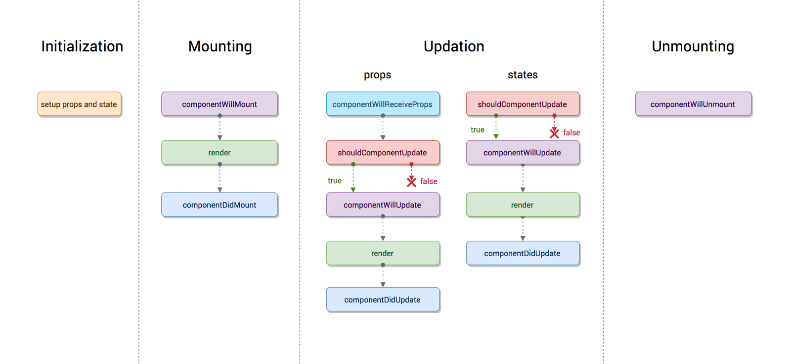
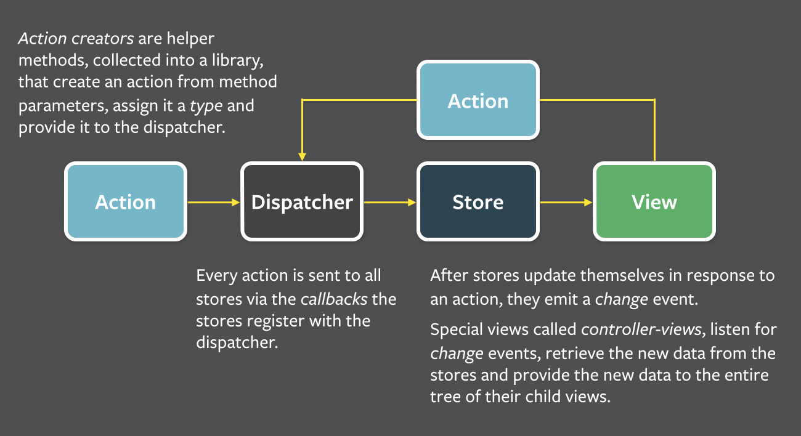

# React

**Ссылки на материал**

**`https://habr.com/ru/company/otus/blog/517560/`**

#### Что такое React

**React** — это библиотека JavaScript с открытым исходным кодом, созданная Facebook для разработки сложных интерактивных пользовательских интерфейсов в веб- и мобильных приложениях. Основная цель React — создание компонентов пользовательского интерфейса; их часто называют просто «V» (View) в архитектуре «MVC». 

**MVC** - расшифровывается как модель-представление-контроллер (от англ. model-view-controller). Это способ организации кода, который предполагает выделение блоков, отвечающих за решение разных задач. Один блок отвечает за данные приложения, другой отвечает за внешний вид, а третий контролирует работу приложения. 

Компоненты MVC:

- Модель — этот компонент отвечает за данные, а также определяет структуру приложения. Например, если вы создаете To-Do приложение, код компонента model будет определять список задач и отдельные задачи.

- Представление — этот компонент отвечает за взаимодействие с пользователем. То есть код компонента view определяет внешний вид приложения и способы его использования.

- Контроллер — этот компонент отвечает за связь между model и view. Код компонента controller определяет, как сайт реагирует на действия пользователя. По сути, это мозг MVC-приложения.

#### Виртуальная DOM

**Виртуальная DOM** - является представлением реальной `DOM` в памяти. **React** создает кэш структуры данных в памяти, вычисляет результирующие различия и затем эффективно обновляет отображаемую DOM браузера. Это позволяет программисту писать код, как будто вся страница отображается при каждом изменении, в то время как библиотеки React отображают только те подкомпоненты, которые действительно изменяются.

#### В чем разница между состоянием и свойством?

И свойства, и состояние являются простыми объектами **JavaScript**. Хотя оба они содержат информацию, которая влияет на результаты рендеринга, они различаются по функциональности в отношении компонента, т.е.:

- Свойство передается компоненту аналогично параметрам функции

- Состояние управляется внутри компонента аналогично переменным, объявленным внутри функции.

#### Какие существуют фазы жизненного цикла компонентов React?

Существует четыре различных этапа жизненного цикла компонента **React**:

- Инициализация: На этом этапе компонент React готовит установку начального состояния и параметров по умолчанию.

- Монтирование: Компонент **React** готов для монтирования в `DOM` браузера. Этот этап охватывает методы жизненного цикла `componentWillMount` и `componentDidMount`.

- Обновление: На этом этапе компонент обновляется двумя способами, отправляя новые свойства и обновляя состояние. Этот этап охватывает методы жизненного цикла `shouldComponentUpdate`, `componentWillUpdate` и `componentDidUpdate`.

- Размонтирование: На этом последнем этапе компонент не нужен и отключается из `DOM` браузера. Этот этап включает метод жизненного цикла `componentWillUnmount`.

#### Как работает React?

**React** создает виртуальную `DOM`. Когда состояние изменяется в компоненте, он сначала запускает алгоритм «различий», который определяет, что изменилось в виртуальной `DOM`. Вторым шагом является согласование, при котором обновляется `DOM` с результатами сравнения отличий.

#### Что такое JSX?

**JSX** является расширением синтаксиса **JavaScript** и поставляется с полной функциональностью **JavaScript**. `JSX` производит «элементы»**React**. Вы можете встроить любое выражение **JavaScript** в `JSX`, заключив его в фигурные скобки. После компиляции выражения `JSX` становятся обычными объектами **JavaScrip**t. Это означает, что вы можете использовать `JSX` внутри операторов `if` и циклов `for`, назначать его переменным, принимать в качестве аргументов и возвращать из функций.

#### Что такое потомки?

В выражениях **JSX** , которые содержат открывающий и закрывающий тег, содержимое между этими тегами передается в компоненты автоматически в качестве специального свойства: `props.children`. В **React API** есть несколько методов для работы с этим объектом. К ним относятся `React.Children.map`, `React.Children.forEach`, `React.Children.count`, `React.Children.only`, `React.Children.toArray`.

#### Что такое состояние в React?

Состояние похоже на свойство, но оно является частным и полностью контролируется компонентом. `State` — это обязательно объект, который содержит данные и определяет, как компонент отображается и ведет себя.

#### Что такое контролируемые компоненты?

В `HTML` элементы формы, такие как `input`, `textarea` и `select`, как правило, поддерживают свое собственное состояние и обновляют его на основе пользовательского ввода. Когда пользователь отправляет форму, значения из элементов, упомянутых выше, отправляются вместе с формой. В **React** это работает по-другому. Компонент, содержащий форму, будет отслеживать значение ввода в своем состоянии и повторно визуализировать компонент каждый раз, когда вызывается функция обратного вызова `onChange`, например, при обновлении состояния. Элемент ввода формы, значение которого контролируется **React**, таким образом называется «контролируемым компонентом».

#### Что такое Flux?

**Flux** — это парадигма разработки приложений, используемая в качестве замены более традиционного шаблона `MVC`. Это не фреймворк или библиотека, а новый тип архитектуры, который дополняет **React** и концепцию однонаправленного потока данных. Facebook использовал этот шаблон при работе над **React** для создания рабочего процесса между компонентами диспетчера, хранилища и представления с различными входами и выходами следующим образом:

#### Что такое Redux?

**Redux** — это контейнер с предсказуемым состоянием для приложений JavaScript, основанный на шаблоне проектирования `Flux`. **Redux** может использоваться вместе с **ReactJS** или с любой другой библиотекой представлений. Он очень компактный (около 2 КБ) и не имеет никаких зависимостей.

#### Как изменяется состояние в Redux?

Единственный способ изменить состояние — это создать действие, объект, описывающий произошедшее. Это гарантирует, что ни представления, ни сетевые обратные вызовы никогда не будут выполнять запись напрямую в состояние. Вместо этого они выражают намерение преобразовать состояние. Поскольку все изменения централизованы и происходят одно за другим в строгом порядке, не существует существенных условий конкуренции. Поскольку действия являются просто обычными объектами, их можно регистрировать, сериализовать, хранить и затем воспроизводить для целей отладки или тестирования.

#### Что такое «хранилище» в Redux?

**Хранилище** — это объект, который хранит состояние приложения и предоставляет несколько вспомогательных методов для доступа к состоянию, отправки действий и регистрации прослушивателей. Все состояние представлено одним хранилищем. Любое действие возвращает новое состояние через редукторы. Это делает Redux очень простым и предсказуемым.

#### Что такое чистая функция?

В компьютерном программировании чистая функция — это функция, которая имеет следующие свойства:

- Ее возвращаемое значение одинаково для тех же аргументов (без изменений с локальными статическими переменными, нелокальными переменными, изменяемыми ссылочными аргументами или входными потоками с устройств ввода-вывода).

- Ее оценка не имеет побочных эффектов (нет мутации локальных статических переменных, нелокальных переменных, изменяемых ссылочных аргументов или потоков ввода-вывода).

Таким образом, чистая функция является вычислительным аналогом математической функции.

#### Как бы вы отключили хранилище Redux, чтобы оно не принимало никаких изменений в состоянии?

Один из способов сделать это — установить для флага exit в редукторе корневого состояния значение true, просто оставляя состояние неизменным.