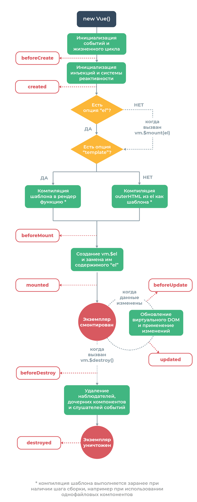

# vue
#### Что такое vue.js

**Vue** — это прогрессивный фреймворк для создания пользовательских интерфейсов. В отличие от фреймворков-монолитов, **Vue** создан пригодным для постепенного внедрения. Его ядро в первую очередь решает задачи уровня представления (`view`), что упрощает интеграцию с другими библиотеками и существующими проектами. С другой стороны, Vue полностью подходит и для создания сложных одностраничных приложений (`SPA, Single-Page Applications`).

#### На каком шаблоне проектирования основан Vue?

**Vue.js** основан на шаблоне проектирования `Model-View-ViewModel(он же MVVM)`, основной мотивацией для этого шаблона является  отделение модели от представления.

#### Как создать новый экземпляр Vue

Каждое **Vue** приложение начинается с создания нового экземпляра **Vue**:

```js
var vm = new Vue({ ... })
```

#### Основные особенности **Vue**

- Реактивность
- Обработка событий
- Шаблоны
- Компоненты
- Роутинг
- Легкий

#### Как передать данные компоненту?

Существует два способа: с помощью атрибут (`props`) или через события.

```
<my-awesome-component some-prop="value">

</my-awesome-component>
```

Когда вам нужно передать данные после какого-то определенного события, вы должны использовать диспетчеров и вещателей.

```
<parent-component>
    <some-child></some-child>
    <another-child></another-child>
</parent-component>
```

Для отправки события из двух дочерних компонентов используйте следующий синтаксис

```js
this.$dispatch('something_happen', data);
// Event listenerevents: 
{
    'something_happen': function(data) {
        // Handle event
    }
}
```

#### Назовите хуки жизненного цикла компонента в **Vue**?

`beforeCreate, created, beforeMount, mounted, beforeUpdate, updated, activated,deactivated, beforeDestroy, destroyed, errorCaptured`

#### Как обновить состояние компонента в **Vue** ?

Для добавления или обновления реактивного свойства в состояние используется метод `Vue.set(объект, ключ, значение)`, вы можете вызвать его с помощью `this`.

```js
this.$set(this.user, 'first_name', 'John')
```

#### ЧЧто такое **Vue CLI**

Это полноценная система для быстрой разработки на **Vue**

**Vue.js** стремится стать стандартным инструментарием для экосистемы **Vue**. Он обеспечивает бесперебойную работу различных инструментов сборки, устанавливает разумные значения по умолчанию, поэтому вы сможете сосредоточиться на разработке приложения, а не проводить дни за его настройкой. В то же время, остаётся гибкость настройки конфигурации каждого инструмента без необходимости извлечения конфигурации в отдельный файл.

#### Что такое компонент

**Компоненты** — это переиспользуемые экземпляры **Vue** со своим именем

**Компонентный подход** помогает выстраивать архитектуру приложения. Сложную страницу можно разбить на маленькие компоненты, которые легче поддерживать.

#### Что такое вычисляемые свойства и когда их нужно использовать?

**Вычисляемые свойства** - это функции, которые возвращают каким-то образом измененные простые свойства, например, у вас есть какое-то свойство text, и вам нужно показать его в верхнем регистре, поэтому вместо хранения двух реквизитов с исходным и прописным текстом вы просто пишете функцию, которая вычисляет необходимое значение на основе исходного свойства.

```js
<div id="root">
  <p>Original message: "{{ someMessage }}"</p>
  <p>Message in uppercase : "{{ uppercasedMessage }}"</p>
</div>
var vm = new Vue({
    el: '#root',
    data: {
        someMessage: 'Hello world!'
    },
    computed: {
        // computed property getter
        uppercasedMessage: function() {
            return this.message.toUpperCase()
        }
    }
})
```

#### Как подключить внешний css файл в **Vue** ?

Если вы используете **webpack**, используйте следующий синтаксис:

```js
<style>
  @import './assets/styles/bootstrap.css';
</style>
```

Если вы предпочитаете стиль старой школы просто тег **style**

```js
<link rel="stylesheet" href="https://maxcdn.bootstrapcdn.com/bootstrap/3.3.7/css/bootstrap.min.css">
```

#### Как подключить jQuery плагин?

Как правило, не рекомендуется использовать плагин **jQuery** в приложениях **Vue**, однако, если нет таких подходящих компонентов и библиотек, вы можете использовать его. Прежде всего импортируйте **jQuery** и плагин.

```js
import $ from 'jquery'
import TextEditor from 'TextEditor'
```

Затем необходимо инициализировать плагин в смонтированном компоненте `lifecycle hook`.

```js
import $ from 'jquery'
import TextEditor from 'TextEditor'
export default class MyComponent extends Vue {
    mounted() {
        $(componentId).textEditor({
            rows: 20,
            cols: 10
        });
    }
}
```

#### Как зарегестрировать компонент в **Vue** ?

Чтобы зарегистрировать компонент глобально, используйте следующий синтаксис.

```js
Vue.component('my-awesome-component', { /* ... some options */ })
```

Первый аргумент - имя нового компонента

Для локальной регистрации компонента используйте компоненты при создании нового экземпляра **Vue**.

```js
new Vue({
    el: '#app'
    components: {
        'header': Header,
        'footer': Footer
    }
})
```

#### Что такое Vuex ?

**Vuex** - это шаблон управления состоянием и библиотека для **Vue.js** приложения. Он предназначен для хранения основных данных для всех компонентов приложения и гарантирует предсказуемость реактивных изменений данных.

#### Как сделать условный рендеринг компонента?

Используйте директивы `v-if` и `v-else`, компонент будет удален из dom, если вы передадите ему ложное условие. Для сохранения элемента в директиве `DOM` `v-show` может быть использовано `css` свойство `display `

```js
<p v-if="true">Visible</p><p v-else>Not visible</p>
```

#### Ести ли в Vue поддержка data binding? Если да, как его использовать?

**Vue** поддержывает `data binding`, для связывания инпута и состояния следует использовать директиву `v-model`.

```js
<input v-model="name" placeholder="What is your name?"><p>Hello, {{ name }}!</p>
```

#### Как реализовать маршрутизацию на стороне клиента  в Vue?

Рекомендуемый способ сделать `SPA` - использовать `Vue Router`, который является официальной библиотекой для маршрутизации, но не включен в основной фреймворк.

#### Как програмно сделать редирект в Vue Router?

Чтобы перейти на другую страницу програмно используйте `router.push(location, onComplete?, onAbort?)`

```js
logOut() {
    userService.removeCurrentSession();
    this.$router.push('/login');
}
```

Также можно вернуться к какой-то точке стека истории с помощью  метода `go(n)`

#### Как защитить какой-то маршрут от несанкционированного доступа?

Его можно сделать внутри компонента или в глобальных `guards`.

```js
const router = new VueRouter({
    ...
})

router.beforeEach((to, from, next) => {
    if (to.isProtected() && !haveAccess(user)) {
        next(false)
    }
    next()
})
```

#### Расскажите о жизненном цикле экземпляра Vue

Жизненный цикл каждого экземпляра **Vue** проходит через ряд шагов инициализации при его создании.
Например, необходимо настроить наблюдение за данными, скомпилировать шаблон и создать необходимые привязки. Попутно он вызывает хуки жизненного цикла, которые дают нам возможность добавлять пользовательскую логику.



#### Что такое миксины Vue

**Миксины** позволяют вам инкапсулировать часть функциональности, чтобы вы могли использовать её в разных компонентах. Правильно написаныне миксины не изменяют ничего вне своей области действия.

#### Как лучше всего создать константу, доступную из всего приложения в Vue

Создать отдельный файл с константами. *`const.js`*

```js
export default {
    const1: 'Constant 1',
    const2: 'Constant 2'
}
```
